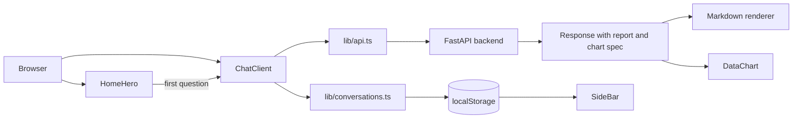

# Inquira UI — Next.js frontend for the Inquira research platform


[Live demo](https://inquira-nine.vercel.app/) | [Backend](https://inquira-a3dk.onrender.com) | [Repository](https://github.com/Sheharyar-Sarmad/Inquira) | [Backend API docs](https://inquira-a3dk.onrender.com/api/v1/docs)

## What this package does

This package is the frontend client for Inquira, a multi-agent research backend. It accepts a research question as text or voice, submits it to the backend as a job, and polls until the result is ready. Completed reports are rendered as markdown with auto-generated charts, and past conversations are listed in a sidebar so they can be reopened later. See the root README for the full agent pipeline and backend details.

## Stack

| Layer | Tech | Why |
|---|---|---|
| Framework | Next.js 15 (App Router), React 19 | Server components for static pages, client components for the chat surface |
| Styling | Tailwind CSS with custom brand tokens | Utility-first styling with a class-based dark mode |
| Animation | Framer Motion, Lenis, React Three Fiber | Scroll-triggered animation, layout transitions, smooth scrolling, and a background scene |
| Markdown | react-markdown, remark-gfm | Renders research reports, including tables and task lists |
| Charts | Recharts | Bar, line, and donut charts generated from report data |
| Diagrams | Mermaid | Architecture diagram on the About page |
| Voice | Web Speech API | Dictation and text-to-speech with no extra dependencies |
| Icons | lucide-react | Consistent icon set that works with tree-shaking |
| Primitives | shadcn/ui | Accessible Button, Sheet, Tooltip, Dialog, and other components owned in-repo |

## Architecture



## Getting started

### Prerequisites

- Node.js 20 or later
- pnpm

### Install

```bash
cd ui
pnpm install
cp .env.example .env.local
```

### Develop

```bash
pnpm dev
```

The app runs at http://localhost:3000.

### Build and preview

```bash
pnpm build
pnpm start
```

## Environment variables

Copy `.env.example` to `.env.local` and fill in the values.

| Variable | Format | Where to get it |
|---|---|---|
| `NEXT_PUBLIC_API_URL` | Base URL with no trailing slash, e.g. `http://localhost:8000` | The address of your running FastAPI backend. For the hosted backend, use `https://inquira-a3dk.onrender.com`. |

```env
NEXT_PUBLIC_API_URL=http://localhost:8000
```

Variables prefixed with `NEXT_PUBLIC_` are embedded in the client bundle at build time, so do not put secrets in them.

## Project structure

```text
ui/
├── app/
│   ├── about/
│   │   └── page.tsx             # Server component, renders AboutClient
│   ├── research/
│   │   └── page.tsx             # Wraps ChatClient in Suspense
│   ├── globals.css              # Tailwind base + design tokens
│   ├── layout.tsx               # Root layout, theme script, fonts, providers
│   ├── not-found.tsx
│   └── page.tsx                 # Home, redirects to /research
├── components/
│   ├── animation/
│   │   ├── SmoothScroll.tsx     # Lenis wrapper
│   │   ├── ThreeBG.tsx          # R3F background (knowledge network)
│   │   └── ThreeBGWraper.tsx
│   ├── helper/
│   │   ├── Chart.tsx            # ChartSpec type + palette helpers
│   │   ├── DataChart.tsx        # Recharts renderer
│   │   ├── Mermaid.tsx          # Client-only Mermaid wrapper
│   │   ├── MicButton.tsx        # Web Speech dictation
│   │   └── Voice.ts             # useSpeechRecognition hook
│   ├── layout/
│   │   ├── AboutClient.tsx      # About page client component
│   │   ├── ChatClient.tsx       # Main chat surface
│   │   └── HomeHero.tsx         # Landing hero + composer entry
│   ├── navigation/
│   │   └── SideBar.tsx          # Sidebar with conversation history
│   └── ui/                      # shadcn primitives
├── lib/
│   ├── api.ts                   # Typed fetch layer for the FastAPI backend
│   ├── conversations.ts         # localStorage conversation store
│   └── utils.ts                 # cn() and misc helpers
├── public/
│   ├── logo.png
│   ├── meta-about-banner.png
│   ├── meta-home-banner.png
│   └── meta-research-banner.png
├── .env.example
└── package.json
```

## Key components

**`ChatClient.tsx`** is the main research surface. It submits a question through `lib/api.ts`, polls the backend until the job finishes, renders the streamed message list, and persists the active session to `sessionStorage` so a refresh does not lose the current conversation.

**`SideBar.tsx`** provides navigation and the conversation history list. It subscribes to `localStorage` events so the list updates when conversations change, including from another tab.

**`DataChart.tsx`** takes a `ChartSpec` and auto-selects a bar, line, or donut chart based on the shape of the data.

**`Mermaid.tsx`** is a lazy-loaded, client-only diagram renderer. Mermaid is imported dynamically so it stays out of the initial bundle and is never evaluated on the server.

**`MicButton.tsx`** and **`Voice.ts`** implement dictation with the Web Speech API. `Voice.ts` exposes a `useSpeechRecognition` hook, and `MicButton.tsx` is the UI control that drives it.

**`conversations.ts`** is the localStorage-backed conversation store. It handles create, read, update, and delete operations and keeps multiple tabs in sync through `storage` events.

**`api.ts`** is a typed fetch layer for the FastAPI backend. Non-OK responses throw an `ApiError` that carries the HTTP status and a `retryAfter` value when the server provides one.

## Voice I/O

Dictation uses the browser's `SpeechRecognition` interface (`webkitSpeechRecognition` where prefixed). `MicButton` starts and stops recognition, and interim transcripts are written into the composer as the user speaks. Text-to-speech uses `speechSynthesis` to read assistant messages aloud.

Both features check for browser support before rendering. If the API is unavailable, as in some Firefox builds, the mic and speaker controls are hidden and the text interface works unchanged. Permission denials and recognition errors are handled without breaking the composer.

## Charts

When the backend returns an assistant message with a `chart: ChartSpec` field, `DataChart.tsx` renders it below the report text. The component inspects the spec to choose a chart type: time or ordered series become line charts, a small set of parts that make up a whole becomes a donut, and categorical comparisons become bars. Rendering is done with Recharts using the palette helpers in `Chart.tsx`. A visually hidden data table is kept behind each chart so screen reader users can access the same values.

## Theming

Dark mode uses Tailwind's class strategy. The selected theme is stored in `localStorage` under the key `inquira:theme`. When no stored value exists, the app falls back to `prefers-color-scheme`. An inline script in `layout.tsx` runs before hydration and sets the class on `<html>`, which prevents a flash of the wrong theme.

## Accessibility

- Reduced-motion preferences are respected for Framer Motion, smooth scrolling, and the background animation.
- ARIA live regions announce new messages in the message stream.
- Icon-only buttons include `sr-only` text labels.
- Every interactive element has a visible `focus-visible` ring.

## Scripts

| Script | Command | Description |
|---|---|---|
| `dev` | `pnpm dev` | Start the development server |
| `build` | `pnpm build` | Create a production build |
| `start` | `pnpm start` | Serve the production build |
| `lint` | `pnpm lint` | Run ESLint |
| `typecheck` | `pnpm typecheck` | Run the TypeScript compiler without emitting files |

## Deployment

The UI is deployed on Vercel from the `/ui` directory. Set the project root to `ui` in the Vercel settings and add `NEXT_PUBLIC_API_URL` as an environment variable. It must point at the deployed FastAPI service, and the backend's CORS configuration must allow the Vercel domain, otherwise browser requests will be blocked.

## Known limitations

- No server-side persistence. Conversations are stored in `localStorage` only.
- Results are retrieved by polling rather than server-sent events.
- Single tenant with no authentication.
- Conversation history is per browser and does not sync across devices.

## Contributing

Issues and pull requests are welcome. Please open an issue to discuss larger changes before starting work, and run `pnpm lint` and `pnpm typecheck` before submitting. Report bugs or suggest features on the [issue tracker](https://github.com/Sheharyar-Sarmad/Inquira/issues).

## License

MIT

## Author

Sheharyar Sarmad

- GitHub: https://github.com/Sheharyar-Sarmad
- LinkedIn: https://www.linkedin.com/in/sheharyar-sarmad-9b7736289/
- Email: developersheharyar2010@gmail.com